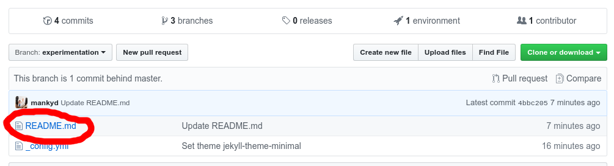
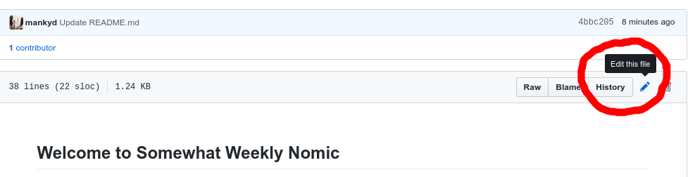
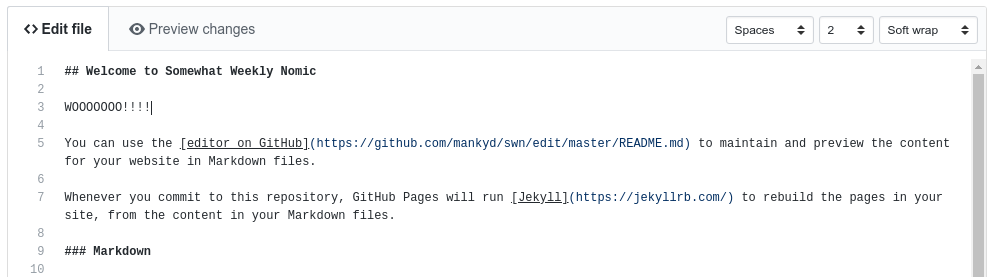
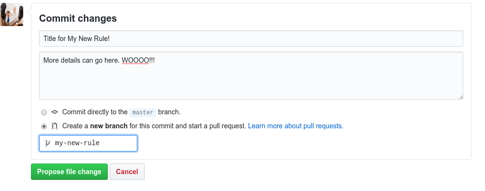
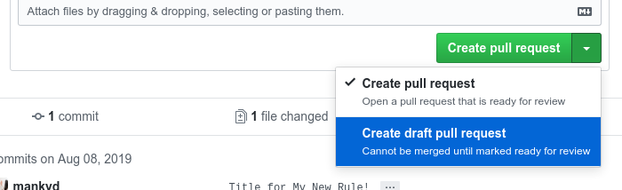

# How To Draft a Proposal

## Step 1: Find the file you want to edit.

Click the "Edit This File" Option (the little pencil).

## Step 2: Make your edits.

Files are written in "Markdown" format. Mostly, just write what looks right.
You can read more about Markdown 
[here](https://guides.github.com/features/mastering-markdown/). It supports
basic formatting, like **bold** and _italics_, as well as links, headings,
lists, and more. Try to keep it simple.

## Step 3: "Commit" your changes in a new branch

Enter a descriptive title, and further description below it. Think of this as
a summary for what your changes actually do to the rules.

Tell it you want to create a "**new branch**" and give a short, identifiable
branch name.

As soon as you you click "Propose file change", your edits will be saved for
others to see in your own _copy_ of the constitution. They won't be merged
into the master copy yet.

## Step 4: Create a "Pull Request".

This step appears to simply summarizes what you did in the previous step. Once
you create a pull request, everyone else will be able to see your change, comment
on it, and approve or reject it.

**We should not (yet) use the review system for voting.**

If you want to edit more than one file, don't create the pull request yet! Go
back, edit any more files you want, and commit them _directly to the branch you
created in Step 3_. Once you're happy with all the changes, you then can create
a pull request with all the changes you've made bunched together.

You can also create
[draft pull requests](https://github.blog/2019-02-14-introducing-draft-pull-requests/)
that will allow people to see and comment, but it can't be accepted or rejected
until you finalize it.

## Step 5: Get approval

Once we've voted on the proposal, wait for someone else to approve the pull request.

